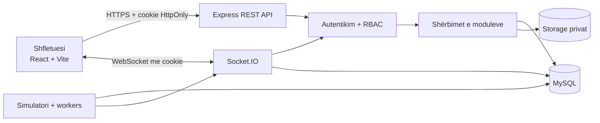
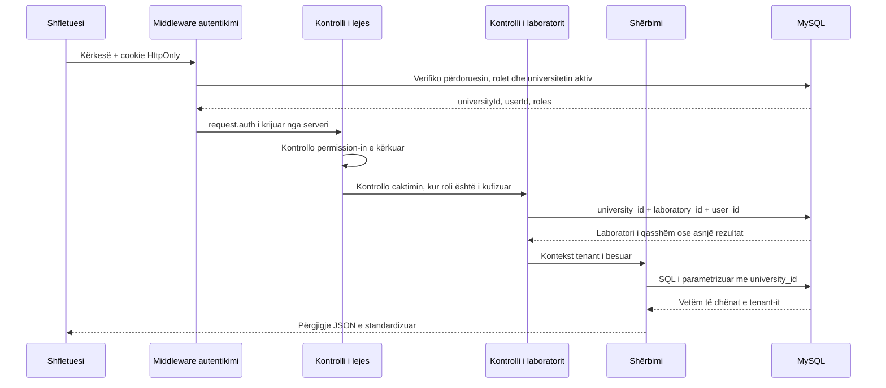

# Arkitektura e CampusLab Twin

## Pamja e përgjithshme

CampusLab Twin është një aplikacion modular me një frontend React, një API
Express, komunikim Socket.IO dhe databazë MySQL. Identifikuesit në kod dhe në
databazë janë në anglisht; ndërfaqja dhe mesazhet për përdoruesin janë në shqip.

Frontend-i përdor React Router për faqet publike, workspace-in e universitetit
dhe administrimin e platformës. Faqet me ngarkesë më të madhe, përfshirë Digital
Twin, grafikët dhe simulimet, ngarkohen me `lazy()`.

API-ja ndahet sipas moduleve të biznesit. Router-at merren vetëm me HTTP,
middleware-in dhe formën e përgjigjes; shërbimet validojnë rregullat e biznesit;
repository-t ekzekutojnë SQL të parametrizuar. Operacionet që ndryshojnë disa
tabela përdorin transaksione me commit ose rollback.

## Kufijtë e autentikimit

Ekzistojnë dy kufij sesioni të ndarë:

- përdoruesit e universiteteve përdorin cookie `clt_access` dhe `clt_refresh`;
- administratorët e platformës përdorin cookie `clt_platform_access` dhe
  `clt_platform_refresh`, me path dhe audience të veçantë.

Cookie-t janë `HttpOnly` dhe `SameSite=Lax`; në production përdorin edhe
`Secure`. Access token-i është jetëshkurtër. Refresh token-i rrotullohet dhe në
databazë ruhet vetëm hash-i i tij. Një token tenant nuk pranohet në kufirin e
platformës dhe anasjelltas.

## Rrjedha multi-tenant e kërkesës

`universityId`, `userId` dhe rolet nuk merren nga body ose query string. Ato
vendosen në `request.auth` vetëm pasi verifikohet cookie. Çdo query tenant e
përfshin `university_id`; burimet e laboratorit kontrollojnë edhe caktimin e
përdoruesit. Një burim i tenant-it tjetër dhe një ID që nuk ekziston kthejnë të
njëjtën përgjigje `404`, pa zbuluar ekzistencën e të dhënave.

## Përditësimet në kohë reale

Socket.IO përdor të njëjtin identitet tenant gjatë handshake-it. Një lidhje
anëtarësohet në dhoma të namespaced:

- `university:<universityId>`;
- `university:<universityId>:user:<userId>`;
- `university:<universityId>:laboratory:<laboratoryId>` vetëm pas kontrollit të
  qasjes.

Simulatori i ruan leximet para publikimit. Leximet e sensorëve dhe energjisë
dërgohen si batch për çdo tick, ndërsa alarmet dhe njoftimet dërgohen vetëm në
dhomat e universitetit, laboratorit ose përdoruesit përkatës.

## Proceset në background

Kur serveri niset dhe lidhja MySQL është gati, aktivizohen:

- rikthimi i simulimeve që kishin status `running`;
- agregimi dhe retention-i i leximeve historike;
- njoftimet për mirëmbajtjet që afrohen;
- kontrolli i anomalive energjetike.

Worker-at parandalojnë ekzekutimet që mbivendosen. Gabimet raportohen pa e
ndalur HTTP serverin dhe pa ekspozuar detaje të brendshme te klienti.

## Skedarët dhe modelet 3D

Databaza ruan metadata dhe pronësinë tenant të skedarit; përmbajtja ruhet jashtë
folderit publik. Download-i kalon përmes autentikimit dhe kontrollit tenant.
Modelet GLB/GLTF kontrollohen për madhësi, format dhe referenca të jashtme para
lidhjes me laboratorin. Nëse modeli nuk hapet, Digital Twin përdor skenën bazë
3D dhe vazhdon të paraqesë zonat, pajisjet dhe sensorët e autorizuar.
