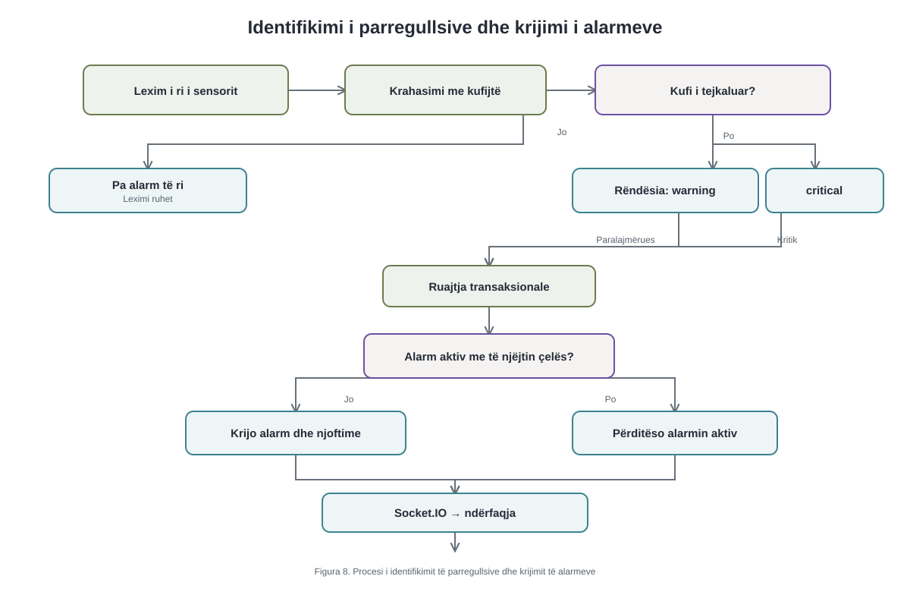
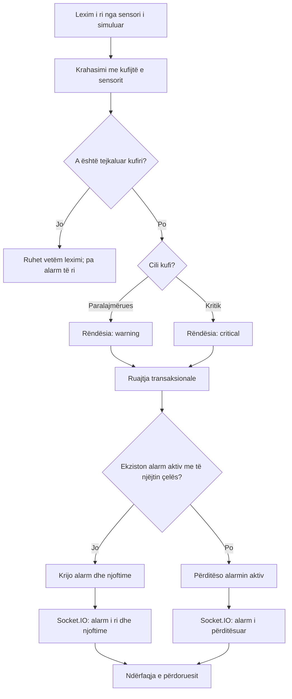

# CampusLab Twin – Identifikimi i parregullsive dhe krijimi i alarmeve


Në CampusLab Twin, çdo lexim i gjeneruar për një sensor online krahasohet me kufijtë paralajmërues dhe kritikë të konfiguruar për atë sensor. Nëse një kufi tejkalohet, sistemi përgatit një kandidat alarmi; regjistrimi i tij dhe dërgimi i njoftimeve ndodhin vetëm pasi hapi i simulimit përpunohet me sukses.




Burimi Mermaid: [campuslab-twin-alert-flow.mmd](campuslab-twin-alert-flow.mmd).



**Saktësim i figurës:** Pyetja për alarmin aktiv paraqet rezultatin logjik të indeksit unik dhe `ON DUPLICATE KEY UPDATE`; kodi nuk kryen një `SELECT` të veçantë. Dega normale ruan leximin në transaksion dhe e publikon si lexim, por nuk krijon alarm të ri. Nuk ka mbyllje automatike të një alarmi ekzistues kur vlera kthehet normale. Përmes të njëjtit `ON DUPLICATE KEY UPDATE`, një alarm `acknowledged` ose `in_progress` mund të përditësohet pa u kthyer në `new`.


Përparësi kanë kufijtë kritikë: kodi kontrollon së pari minimumin dhe maksimumin kritik, pastaj kufijtë paralajmërues. Alarmet aktive me të njëjtin çelës deduplikohen në bazën e të dhënave; një shkelje e përsëritur përditëson alarmin ekzistues. Pas ruajtjes, ndërfaqja merr ngjarjen për alarm të ri ose të përditësuar përmes Socket.IO.


Fragmenti vijues është marrë pa ndryshime nga funksioni `evaluateSensorReading`. Ai tregon rendin e krahasimit të vlerës së sensorit me katër kufijtë dhe klasifikimin e shkeljes si kritike ose paralajmëruese.


```js
  const violation = [
    ["critical_min", sensor.criticalMin, (current, limit) => current < limit],
    ["critical_max", sensor.criticalMax, (current, limit) => current > limit],
    ["warning_min", sensor.warningMin, (current, limit) => current < limit],
    ["warning_max", sensor.warningMax, (current, limit) => current > limit],
  ].find(([, rawLimit, violates]) => {
    const limit = Number(rawLimit);
    return rawLimit != null && Number.isFinite(limit) && violates(value, limit);
  });

  if (!violation) return null;
  const [threshold, rawLimit] = violation;
  const severity = threshold.startsWith("critical") ? "critical" : "warning";
```


Metoda `.find()` zgjedh shkeljen e parë të vlefshme, prandaj kufiri kritik ka përparësi ndaj atij paralajmërues. Nëse asnjë kufi nuk shkelet, funksioni kthen `null`; përndryshe, fusha `severity` merr vlerën `critical` ose `warning`. Krahasimet janë strikte (`<` dhe `>`), kështu që barazia me kufirin nuk krijon alarm.

## Rrjedha e verifikuar në kod

1. `generateSimulationStep` prodhon lexime vetëm për sensorët online të laboratorit. `loadRuntime` ngarkon së bashku me sensorët kufijtë `warningMin`, `warningMax`, `criticalMin` dhe `criticalMax` (`server/src/modules/simulator/repository.js:449–473`; `server/src/modules/simulator/generator.js:84–117`).
2. `execute` thërret `evaluateSimulationReadings` **para** `persistStep` (`server/src/modules/simulator/coordinator.js:51–81`). Kjo është vlerësim në memorie; nuk është ruajtje e alarmit.
3. `evaluateSensorReading` hedh poshtë vlerat jo numerike; kontrollon kritik-min, kritik-max, warning-min, warning-max; kthen `null` kur s’ka shkelje (`server/src/modules/alerts/rule-engine.js:8–57`). Një vlerë warning dhe një vlerë critical ndjekin të njëjtin proces ruajtjeje, me `severity` të ndryshme.
4. `persistStep` ruan leximet dhe përdor `INSERT INTO alerts ... ON DUPLICATE KEY UPDATE` (`server/src/modules/simulator/repository.js:506–595`). Migrimi `009` krijon `active_deduplication_key` vetëm për statuset `new`, `acknowledged`, `in_progress` dhe indeksin unik për universitetin e çelësin aktiv (`server/migrations/009_active_alert_deduplication.up.sql:1–13`). Pra nuk ekziston kontroll paraprak me `SELECT`.
5. Njoftimet në `notifications` krijohen vetëm kur `affectedRows === 1`, pra për alarm të krijuar rishtas, për përdoruesit e përzgjedhur (`server/src/modules/simulator/repository.js:596–642`). Leximet, alarmet, njoftimet dhe përditësimi i `simulation_runs` janë në një transaksion (`repository.js:517–687`).
6. Pas ruajtjes së suksesshme, `publishAlert` dërgon `alert:created` ose `alert:updated` në dhomën e laboratorit; për alarm të ri dërgon edhe `notification:created` te marrësit (`server/src/modules/simulator/coordinator.js:82–101`; `server/src/realtime/publisher.js:101–135`).

## Simulation Implementation Evidence

| Purpose | File | Function | Exact lines | Explanation |
|---|---|---|---:|---|
| Pranimi/gjenerimi i leximit | `server/src/modules/simulator/coordinator.js`; `server/src/modules/simulator/generator.js` | `execute`; `generateSimulationStep` | 41–69; 84–117 | Gjeneron leximet e sensorëve të simulimit dhe ia kalon rregullit. |
| Ngarkimi i kufijve | `server/src/modules/simulator/repository.js` | `loadRuntime` | 449–473 | Lexon sensorët online dhe katër kufijtë nga `sensors`. |
| Threshold evaluation | `server/src/modules/alerts/rule-engine.js` | `evaluateSensorReading` | 8–22 | Zgjedh shkeljen e parë; pa shkelje kthen `null`. |
| Severity classification | `server/src/modules/alerts/rule-engine.js` | `evaluateSensorReading` | 23–24 | Përcakton `critical` ose `warning`. |
| Existing alert check | `server/migrations/009_active_alert_deduplication.up.sql`; `server/src/modules/simulator/repository.js` | indeks unik; `persistStep` | 1–13; 564–576 | Deduplikim nga databaza, pa `SELECT` paraprak. |
| Alert creation/update | `server/src/modules/simulator/repository.js` | `persistStep` | 564–595 | `INSERT ... ON DUPLICATE KEY UPDATE`; shënon nëse u krijua. |
| Database persistence | `server/src/modules/simulator/repository.js` | `persistStep` | 506–687 | Transaksion për leximet, alarmet, njoftimet dhe run-in. |
| Notification creation | `server/src/modules/simulator/repository.js` | `persistStep` | 596–642 | Njoftim vetëm për alarm të ri dhe marrës të autorizuar. |
| Socket.IO publication | `server/src/modules/simulator/coordinator.js`; `server/src/realtime/publisher.js` | `execute`; `publishAlert` | 82–101; 101–135 | Pas ruajtjes emeton alarm të ri/të përditësuar; njoftim vetëm për të riun. |


Teksti aktual i tezës nuk është dhënë për krahasim literal. Kodi **nuk** bën `SELECT` të veçantë për alarm aktiv; **nuk** krijon njoftim të ri për çdo shkelje të përsëritur; **nuk** mbyll automatikisht alarmin kur vlera normalizohet; dhe anomalitë e energjisë krijojnë njoftime, jo alarme në tabelën `alerts`.
