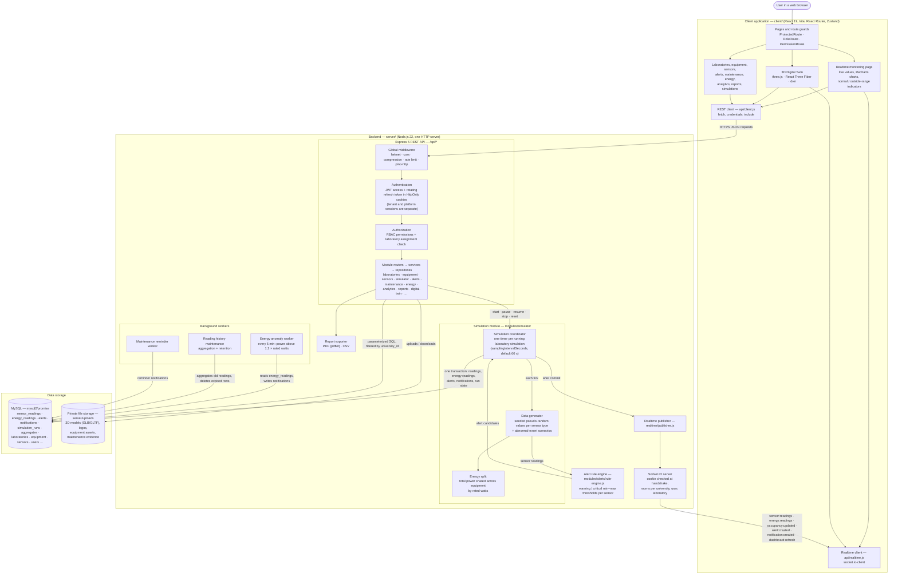
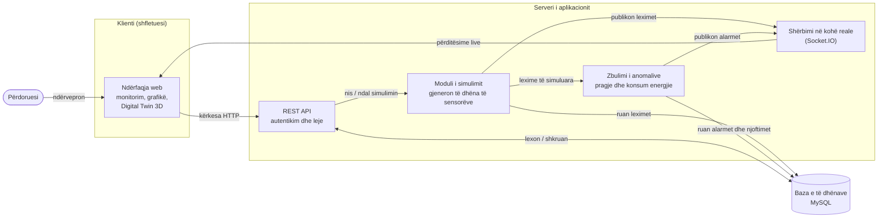

# CampusLab Twin – System Architecture

This document describes the architecture of CampusLab Twin as it is implemented
in the repository today. Every component and arrow below was traced in the
source code; the section "Evidence from the Codebase" lists where.

## 1. Technical architecture diagram

### Legend

| Notation | Meaning |
| --- | --- |
| Rectangle | Software component |
| Cylinder | Persistent storage |
| Solid arrow | Call or data flow in the arrow's direction |
| `sensor:readings`, `alert:created`, … | Socket.IO event names as they appear in the code |

## 2. Architecture Verification

### How the diagram was verified

- The server entry point `server/src/index.js` was read to see which services,
  workers and servers are actually created and started.
- `server/src/app.js` was read to confirm the middleware order and every mounted
  `/api/*` route.
- One simulated reading was traced from `coordinator.js` through `generator.js`,
  `rule-engine.js`, `repository.js#persistStep`, `publisher.js` and
  `create-realtime-server.js` to the client (`api/realtime.js`,
  `RealtimeMonitoringPage.jsx`, `DigitalTwinPage.jsx`).
- The whole server was searched for `INSERT INTO sensor_readings`. The only
  match is the simulator repository, so the simulator is the only source of
  sensor readings.

### Implementation status

| Item | Status |
| --- | --- |
| Server-side simulation of sensor and energy data | Implemented |
| Threshold alerts for sensor readings | Implemented |
| Energy anomaly detection (power above rated watts) | Implemented as notifications, not as alert records |
| Realtime delivery over Socket.IO | Implemented |
| 3D Digital Twin view | Implemented. It uses API and realtime readings; when a sensor has no reading, the 3D view fills in a local visual placeholder value (see note below) |
| Data from physical IoT devices | **NOT IMPLEMENTED.** The database `source` column allows `physical`, `imported` and `manual`, but there is no endpoint, protocol client (MQTT, Modbus, …) or code path that writes non-simulated readings |
| Machine-learning / statistical anomaly detection | **NOT IMPLEMENTED.** Detection is rule based (fixed thresholds and a rated-power multiplier) |

Note on the 3D view: `client/src/components/digital-twin/useTwinSimulation.js`
produces a small sine-wave value every 5 s for twin sensors that have no API
reading. This happens only in the browser, so the values are never stored and
never trigger alerts. The 3D view should be described as a visualization with a
placeholder fallback, not as a second data source.

## 3. Major components

**Client application (React SPA).** The client is built with Vite and routed
with React Router into public pages, the university workspace and the platform
administration area. Route guards hide pages the user's role or permissions do
not allow, and session state is kept in Zustand stores. The client talks to the
backend through two modules: `api/client.js` for REST (`fetch` with cookies)
and `api/realtime.js` for Socket.IO.

**Realtime monitoring page.** When it opens, the page loads a snapshot over
REST: dashboard summary, alerts, sensors and equipment. After that it applies
each `sensor:reading` and `energy:reading` event to its state and to a rolling
chart of the last 40 points. On `alert:created` or `alert:updated` it loads the
snapshot again. `client/src/utils/monitoring-standards.js` marks a value as
*normal* or *outside* using the sensor's warning limits, or default ranges when
limits are missing. This is a display indicator only and creates no alerts.

**3D Digital Twin.** The laboratory, its zones, equipment, IoT devices and
cameras are rendered with three.js through React Three Fiber. Live sensor
values from the same REST snapshot and Socket.IO events color and label the
scene. Twin assets and operator messages are stored through
`/api/digital-twin`.

**Express REST API.** Every request passes the same chain: global middleware,
then cookie-based JWT authentication, then permission checks and, for
laboratory resources, the user's laboratory assignment. Routers only handle
HTTP, services apply business rules and validation (zod), and repositories run
parameterized SQL that always filters by `university_id`. The platform has 26
route groups under `/api`.

**Simulation module.** A user starts a simulation for one laboratory
(`POST /api/simulator/laboratories/:id/start`) and can pause, resume, stop or
reset it. The coordinator runs one timer per laboratory. On each tick the
generator moves every sensor type (temperature, humidity, CO₂, occupancy,
smoke, power, voltage, equipment health) toward a target value. Random noise
comes from a seeded generator, so a run can be reproduced. A tick can also
include a scripted abnormal event such as temperature rise, ventilation
failure, power spike or smoke incident. Total power is split across the
laboratory's equipment in proportion to their rated watts. When the server
restarts, runs that were `running` are resumed.

**Alert rule engine.** Before anything is saved, each generated reading is
compared with its sensor's `criticalMin`, `criticalMax`, `warningMin` and
`warningMax` limits. A reading outside a limit becomes an alert candidate with
severity *critical* or *warning*. Alerts are de-duplicated per sensor, and each
new alert creates notifications for the responsible users.

**Energy anomaly worker.** Every 5 minutes this background job checks the
latest power reading of each piece of equipment from the last 15 minutes. If
the reading is above 1.2 × the equipment's rated power, the worker writes an
"abnormal energy consumption" notification for the responsible user, the
university administrators and the laboratory managers.

**Realtime layer (Socket.IO).** Socket.IO runs on the same HTTP server as the
API. At handshake it verifies the tenant access cookie. Each socket joins its
university room and its user room. It joins a laboratory room only after the
server checks that the user may access that laboratory. The publisher sends
events only to these rooms.

**Data storage.** MySQL is the only database. It holds users, roles,
laboratories, zones, equipment, sensors, readings, aggregates, alerts,
notifications, simulations, reports, audit logs and digital-twin data, all
created by 18 versioned migrations. File contents are stored outside the public
folder in `server/uploads`, and their metadata is stored in MySQL.

**Supporting workers and reports.** The reading-history worker aggregates old
readings and deletes those past the retention period. The maintenance reminder
worker creates notifications for upcoming maintenance. The reports module
exports PDF files (pdfkit) and CSV files.

## 4. End-to-end data flow of one simulated value

1. **Start.** An authorized user starts a simulation from the Simulations
   page. The API checks permissions and creates a `simulation_runs` row with
   status `running`, and the coordinator starts a timer for that laboratory.
2. **Generation.** When the timer fires, the coordinator loads the run and the
   laboratory's sensors and equipment. `generateSimulationStep` then produces
   one value per sensor, for example a temperature of 27.4 °C.
3. **Processing.** Energy readings are derived from the simulated total power.
   The rule engine compares each reading with the sensor's limits. If 27.4 °C
   is above the sensor's `warningMax`, a *warning* alert candidate is created.
4. **Storage.** In one MySQL transaction the server inserts the sensor
   readings and energy readings, inserts or updates the de-duplicated alert,
   creates notifications for recipients and saves the new generator state on
   the run.
5. **Publication.** Only after the transaction commits, the publisher emits
   `sensor:readings`, `occupancy:updated`, `energy:readings`,
   `simulation:updated` and `dashboard:refresh` to the laboratory room. It also
   emits `alert:created` to the laboratory room and `notification:created` to
   each recipient's user room.
6. **Delivery to the frontend.** The browser is subscribed to the laboratory
   room through `api/realtime.js` and receives the batch. Pages that open later
   or reconnect get the same data over REST, for example
   `/api/dashboard/summary`, because the readings were already saved.
7. **Presentation.** The monitoring page updates the value, the chart and the
   normal/outside indicator, and shows the new alert. The 3D Digital Twin
   updates the matching sensor in the scene. The notification menu loads the
   stored notification from `/api/notifications`.
8. **Later checks.** The energy anomaly worker reviews recent energy readings
   every 5 minutes. The history worker aggregates and removes old readings
   according to the retention settings.

## 5. Evidence from the Codebase

| Component | Evidence in codebase | Purpose |
| --- | --- | --- |
| Client application | `client/package.json`, `client/vite.config.js`, `client/src/App.jsx`, `client/src/main.jsx` | React 19 SPA built with Vite and routed with React Router |
| Route guards | `client/src/routes/ProtectedRoute.jsx`, `RoleRoute.jsx`, `PermissionRoute.jsx`, `PlatformProtectedRoute.jsx` | Hide pages the session, role or permissions do not allow |
| Client session state | `client/src/stores/auth-store.js`, `platform-auth-store.js` | Zustand stores for tenant and platform sessions |
| REST client | `client/src/api/client.js` | `fetch` wrapper that sends cookies |
| Realtime client | `client/src/api/realtime.js` | Socket.IO connection, `laboratory:join`, event handlers |
| Realtime monitoring | `client/src/pages/RealtimeMonitoringPage.jsx`, `client/src/components/MonitoringIndicators.jsx`, `client/src/utils/monitoring-standards.js` | Live values, charts and normal/outside indicators |
| 3D Digital Twin | `client/src/pages/DigitalTwinPage.jsx`, `client/src/components/digital-twin/` (`DigitalTwinCanvas.jsx`, `useTwinSimulation.js`, `dynamic-scene.js`) | three.js scene driven by API and realtime data, with a visual fallback |
| Other workspace features | `client/src/pages/` (Laboratories, Equipment, Sensors, Maintenance, Energy, Analytics, Reports, Simulations) | Management pages |
| Server bootstrap | `server/src/index.js` | Creates the pool, services, coordinator, workers and Socket.IO; starts HTTP |
| Express API and middleware | `server/src/app.js`, `server/src/middleware/` | Middleware chain and `/api/*` route mounting |
| Authentication | `server/src/middleware/authenticate-tenant.js`, `authenticate-platform.js`, `server/src/modules/auth/`, `server/src/modules/platform-auth/` | JWT in HttpOnly cookies, rotating refresh tokens |
| Authorization (RBAC) | `server/src/authorization/permissions.js`, `server/src/middleware/require-permission.js`, `require-laboratory-access.js`, `docs/rbac.md` | Permission and laboratory-assignment checks |
| Business modules | `server/src/modules/*/router.js`, `service.js`, `repository.js` | Router → service → repository per feature |
| Simulation coordinator | `server/src/modules/simulator/coordinator.js` | Timers, tick execution, energy split, persistence, publication |
| Data generator | `server/src/modules/simulator/generator.js`, `scenarios.js` | Seeded values per sensor type and abnormal-event scenarios |
| Simulation control API | `server/src/modules/simulator/router.js`, `service.js` | preview, start, pause, resume, stop, reset |
| Transactional persistence | `server/src/modules/simulator/repository.js` (`persistStep`), `server/src/database/query.js` (`withTransaction`) | Saves readings, alerts, notifications and run state together |
| Alert rule engine | `server/src/modules/alerts/rule-engine.js`, `server/src/modules/alerts/` | Threshold evaluation and alert management |
| Energy anomaly detection | `server/src/modules/energy/anomaly-worker.js`, `anomaly-repository.js` | Power above 1.2 × rated watts → notifications |
| Reading history | `server/src/modules/simulator/history-maintenance.js`, `history-repository.js` | Aggregation and retention |
| Maintenance reminders | `server/src/modules/maintenance/reminder-worker.js` | Notifications for upcoming maintenance |
| Realtime server | `server/src/realtime/create-realtime-server.js`, `publisher.js`, `docs/socket-io.md` | Authenticated sockets, rooms, event publishing |
| Reports | `server/src/modules/reports/exporter.js` | PDF (pdfkit) and CSV export |
| Database | `server/src/database/pool.js`, `server/migrations/001–018*.sql`, `server/seeds/` | MySQL schema, migrations and demo data |
| File storage | `server/src/storage/*.js`, `server/uploads/` | Private storage for models, logos, assets and evidence |
| Physical IoT ingestion | No code found; only the `source` enum in `server/migrations/001_initial_schema.up.sql` | **NOT IMPLEMENTED** |

## 6. Simplified diagram

*Figura 3. Arkitektura e propozuar e sistemit CampusLab Twin*

For simplicity, this diagram puts the energy anomaly worker under "Zbulimi i
anomalive". That worker saves notifications to the database but does not
publish them in real time; only threshold alerts are pushed through Socket.IO.
If the thesis text needs to be exact, mention this in the paragraph that
explains the figure.
