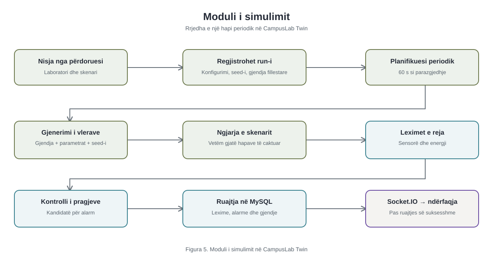

# CampusLab Twin – Moduli i simulimit

**Figura 5. Moduli i simulimit në CampusLab Twin**



Burimi Mermaid: [campuslab-twin-simulation-module.mmd](campuslab-twin-simulation-module.mmd). Figura paraqet rrjedhën logjike të një hapi; nuk nënkupton se ngjarja jonormale është aktive në çdo hap.

## A. Rrjedha reale e simulimit

Përdoruesi zgjedh laboratorin, skenarin dhe intervalin, pastaj faqja dërgon kërkesën e nisjes. Shërbimi verifikon hyrjen dhe repository krijon një `simulation_runs` me status `running`, konfigurimin, vlerën `seed` dhe gjendjen fillestare. Koordinatori vendos `setInterval`; **nuk gjeneron lexim menjëherë në nisje**. Në çdo aktivizim të timer-it, ngarkon gjendjen aktuale, sensorët online dhe pajisjet aktive; krijon hapin me gjeneratorin; llogarit leximet e energjisë; vlerëson shkeljet e pragjeve; i ruan në transaksion MySQL; përditëson gjendjen e run-it; dhe vetëm pas ruajtjes publikon ngjarjet Socket.IO. Frontend-i i monitorimit merr leximet e reja dhe përditëson gjendjen/grafikun. Një hap i ri nuk nis paralelisht nëse hapi i mëparshëm është ende duke u ekzekutuar.

Pezullimi dhe ndalimi ndryshojnë statusin në databazë dhe heqin timer-in; rifillimi e vendos përsëri. `reset` ndal timer-in dhe rikthen gjendjen bazë të run-it, pa fshirë leximet historike. Koordinatori rikthen timer-at e run-eve `running` pas rinisjes së serverit.

## B. Intervali i mostrimit

Parazgjedhja është **60 sekonda** (`startSchema`, `server/src/modules/simulator/service.js:10–14`; vlera fillestare e UI-së, `client/src/pages/SimulationsPage.jsx:83–90`). Fusha pranon numra të plotë **1–3600 sekonda**. UI-ja ofron 5, 30, 60 ose 300 sekonda (`client/src/pages/SimulationsPage.jsx:348–360`). Intervali ruhet në `simulation_runs.input_json` (`server/src/modules/simulator/repository.js:243–267`) dhe shumëzohet me 1000 për `setInterval` (`server/src/modules/simulator/coordinator.js:20–38`). Intervali zgjidhet kur nis run-i; nuk ka rrugë API për ta ndryshuar gjatë tij. Nëse ekzekutimi zgjat më shumë se intervali, një tick mund të anashkalohet (`coordinator.js:41–43`), prandaj 60 sekonda është periudha e planifikuar, jo garanci e saktë kohore për çdo lexim.

## C. Gjenerimi i vlerave

Gjeneratori fillon nga gjendja e mëparshme ose vlerat fillestare, rrit numrin e hapit (`tick`) dhe krijon numra pseudo-rastësorë deterministë nga `seed:tick`; për zhurmën individuale të sensorit përdor `seed:tick:sensor.id` (`generator.js:34–66,84–117,280–298`). Objektivat llogariten nga zënia bazë/kapaciteti, ngarkesa dhe fuqia e pajisjeve, ventilimi, temperatura e ambientit, lagështia bazë dhe gjendja e pajisjeve (`generator.js:126–204`). Vlera i afrohet objektivit me ndryshim maksimal për hap, zhurmë të vogël dhe kufizim në intervalin e lejuar (`generator.js:69–82,218–255,300–309`). Zënia rrumbullakohet në persona të plotë. Simulohen edhe CO₂, tymi, tensioni dhe `equipment_health`; ky i fundit është vlerë e gjendjes së gjeneruar, **jo ndryshim automatik i kolonës `equipment.status`** (`generator.js:207–215`; `repository.js:474–482,529–562`).

Fuqia e përgjithshme në vat llogaritet nga `activeEquipmentWatts × equipmentLoad`, penaliteti i degradimit dhe shumëzuesi i ngjarjes (`generator.js:189–193`). Pastaj ndahet proporcionalisht mes pajisjeve aktive sipas `energy_rating_watts`; `energy_kwh = powerWatts × intervalSeconds / (3600 × 1000)` (`coordinator.js:190–204`). Sensorë lexohen vetëm nëse janë online dhe lloji i tyre mbështetet nga gjeneratori (`repository.js:461–473`; `generator.js:84–117`).

## D. Injketimi i parregullsive

Kjo është **ngjarje e skenarit e konfiguruar, jo aktivizim probabilistik**. Gjatë nisjes, `buildScenarioConfiguration` bashkon konfigurimin e ruajtur me `overrides` dhe krijon `abnormalEvent` sipas llojit të skenarit (`scenarios.js:3–44,46–96`; `repository.js:219–249`). Vlerat e parazgjedhura janë `startTick: 3`, `durationTicks: 8`, `intensity: 1`. Ngjarja është aktive vetëm kur `tick >= startTick` dhe `tick < startTick + durationTicks` (`generator.js:259–264`). Për skenarin `temperature_rise`, objektivit të temperaturës i shtohen `5 × intensity` °C (`generator.js:152–164`), por temperatura e matur ndryshon gradualisht, normalisht maksimumi 0.25 °C për hap (`generator.js:23–32,69–82`); pra nuk kërcen menjëherë me 5 °C. Skenarë të tjerë ndryshojnë ventilimin, zënien, tymin, fuqinë ose shëndetin e pajisjes; `sensor_offline` heq leximet e sensorit të synuar për hapat aktivë (`generator.js:85–93`).

Alarmet janë **mekanizëm më vete**: gjenerohen vetëm kur një lexim realisht kalon pragjet `warning_min/max` ose `critical_min/max` të sensorit (`rule-engine.js:8–57`). Aktivizimi i një ngjarjeje skenari nuk garanton alarm. Kandidatët llogariten përpara ruajtjes (`coordinator.js:67–81`); ruajtja e leximeve, alarmeve dhe njoftimeve bëhet brenda transaksionit (`repository.js:506–687`).

## E. Ruajtja dhe lidhja me run-in

Leximet e sensorëve shkojnë në `sensor_readings` me `source='simulated'` dhe `simulation_run_id=runId` (`repository.js:529–545`; `server/migrations/001_initial_schema.up.sql:312–334,520–523`). Leximet e energjisë shkojnë në `energy_readings` me `source='simulated'`, por **kjo tabelë nuk ka kolonë `simulation_run_id`** (`repository.js:546–562`; migrimi `001_initial_schema.up.sql:336–349`). `simulation_runs.result_json` ruan gjendjen e gjeneratorit dhe numërimet; `simulation_run_events` merr ngjarjet `reading_generated`/`alert_generated` (`repository.js:644–685`).

## F. Dërgimi në frontend

Pas konfirmimit të transaksionit, koordinatori thërret `publishSimulationStep` dhe `publishAlert` (`coordinator.js:82–101`). Publikuesi dërgon `sensor:readings`, `energy:readings`, `occupancy:updated`, `simulation:updated`, `dashboard:refresh` dhe, nëse ka alarm, `alert:created`/`alert:updated` në dhomën Socket.IO të laboratorit (`server/src/realtime/publisher.js:21–27,34–107`). Anëtarësimi në dhomë kontrollon qasjen te laboratori (`server/src/realtime/create-realtime-server.js:50–82`). Klienti i monitorimit i shndërron paketat në ngjarje për leximet individuale dhe përditëson vlerat/grafikun (`client/src/api/realtime.js:70–104`; `client/src/pages/RealtimeMonitoringPage.jsx:157–195`).

## G. Fragmentet e rekomanduara për kapitullin 5.2

**Fragmenti A — planifikimi periodik.** `server/src/modules/simulator/coordinator.js`, `activate`, rreshtat **23–36** (14 rreshta; mund të shkurtohet në figurën e tezës duke ruajtur kodin fjalë për fjalë):

```js
    const runtime = await repository.loadRuntime(reference);
    if (!runtime || runtime.status !== "running") return false;
    const intervalSeconds = Math.max(
      1,
      Number(runtime.input.samplingIntervalSeconds) || 60,
    );
    const process = {
      reference: runtimeReference(runtime),
      executing: false,
      timer: null,
    };
    process.timer = setIntervalFunction(() => {
      void execute(process);
    }, intervalSeconds * millisecondsPerSecond);
```

Fragmenti tregon intervalin e ruajtur në run dhe planifikimin e hapave periodikë. **Nëse profesori kërkon vetëm një fragment, zgjidhni këtë**, pasi vërteton qartë frekuencën.

**Fragmenti B — injektimi i skenarit të temperaturës.** `server/src/modules/simulator/generator.js`, `calculateTargets`, rreshtat **152–164**:

```js
  if (event) {
    const intensity = clamp(numberOr(event.intensity, 1), 0.1, 10);
    if (event.type === "ventilation_failure") ventilation = 0;
    if (event.type === "overcapacity") {
      occupancy = Math.min(capacity * (1 + 0.25 * intensity), 500);
    }
    if (event.type === "smoke_incident") smokeTarget = 12 * intensity;
    if (event.type === "power_spike") powerMultiplier += 0.65 * intensity;
    if (event.type === "energy_saving") {
      powerMultiplier *= Math.max(0.25, 1 - 0.3 * intensity);
    }
    if (event.type === "temperature_rise") temperatureOffset = 5 * intensity;
  }
```

Fragmenti tregon ndikimin e ngjarjeve të skenarit te objektivat; `temperature_rise` shton kompensimin termik kur ngjarja është aktive. Fragmenti është pak mbi gjatësinë e synuar; për tezë mund të përdoren veçmas rreshtat 159–164, pa i ndryshuar.

## H. Simulation Implementation Evidence

| Qëllimi | File | Funksioni | Rreshtat | Shpjegimi |
|---|---|---|---:|---|
| Nisja HTTP dhe autorizimi | `server/src/modules/simulator/router.js` | `createSimulatorRouter` | 13–16, 76–89 | Ruta kërkon autentikim dhe leje për simulime. |
| Validimi dhe nisja | `server/src/modules/simulator/service.js` | `startSchema`, `start` | 10–14, 211–238 | Intervali 1–3600 s; krijon run-in dhe aktivizon koordinatorin. |
| Krijimi i run-it | `server/src/modules/simulator/repository.js` | `start` | 203–301 | Ngarkon skenarin; ruan konfigurimin, seed-in dhe baseline në `simulation_runs`. |
| Pause/resume/stop/reset | `server/src/modules/simulator/service.js` | `pause`, `resume`, `stop`, `reset`, `transition` | 241–297 | Ndryshon statusin dhe aktivizon/çaktivizon timer-in. |
| Intervali dhe scheduler-i | `server/src/modules/simulator/coordinator.js` | `activate` | 20–39 | `setInterval` sipas sekondave të run-it. |
| Një hap i plotë | `server/src/modules/simulator/coordinator.js` | `execute` | 41–115 | Gjenerim → energji → kontroll pragu → ruajtje → Socket.IO. |
| Konfigurimi i skenarit | `server/src/modules/simulator/scenarios.js` | `buildScenarioConfiguration` | 63–97 | Bashkon vlerat dhe cakton ngjarjen, intensitetin dhe kohëzgjatjen. |
| Gjenerimi/seed | `server/src/modules/simulator/generator.js` | `generateSimulationStep`, `seededRandom` | 50–124, 280–298 | Objektiva deterministë, zhurmë, kufij dhe lexime për sensorët. |
| Injektimi i anomalisë | `server/src/modules/simulator/generator.js` | `calculateTargets`, `activeEvent` | 126–204, 259–264 | Ngjarja aktivizohet sipas tick-ut dhe ndryshon objektivat. |
| Fuqia dhe energjia | `server/src/modules/simulator/coordinator.js` | `buildEnergyReadings` | 190–205 | Ndan fuqinë sipas rating-ut dhe llogarit kWh. |
| Kontrolli i alarmeve | `server/src/modules/alerts/rule-engine.js` | `evaluateSimulationReadings`, `evaluateSensorReading` | 8–57 | Krahason leximet me pragjet e sensorëve. |
| Ruajtja MySQL | `server/src/modules/simulator/repository.js` | `persistStep` | 506–687 | Ruajtje transaksionale e leximeve, alarmeve, njoftimeve dhe gjendjes. |
| Lidhja FK e leximit me run-in | `server/migrations/001_initial_schema.up.sql` | SQL `ALTER TABLE sensor_readings` | 520–523 | `simulation_run_id` referon `simulation_runs`. |
| Publikimi live | `server/src/realtime/publisher.js` | `publishSimulationStep` | 34–100 | Dërgon leximet dhe përditësimin në dhomën e laboratorit. |
| Marrja live | `client/src/api/realtime.js`; `client/src/pages/RealtimeMonitoringPage.jsx` | `connectMonitoringRealtime`; `useEffect` | 70–104; 157–195 | Lidhet me laboratorin dhe përditëson pamjen. |

## I. Diagrami Mermaid për tezën

Mermaid-i i gatshëm është në skedarin `.mmd` pranë këtij dokumenti; figura SVG mund të vendoset drejtpërdrejt në Word. Teksti i figurës nuk përmban rrugë skedarësh apo hollësi implementimi.

## J. Saktësime për tekstin e tezës

Nuk është dhënë teksti aktual i tezës për krahasim fjalë për fjalë. Nëse teksti thotë se leximet krijohen menjëherë pas klikimit “Nis”, se intervali është fiks, se çdo skenar prodhon patjetër alarm, se anomalia është rastësore/probabilistike, se `energy_readings` ka FK te `simulation_runs`, ose se `equipment.status` ndryshohet automatikisht, këto pohime duhen korrigjuar sipas kodit të mësipërm.
