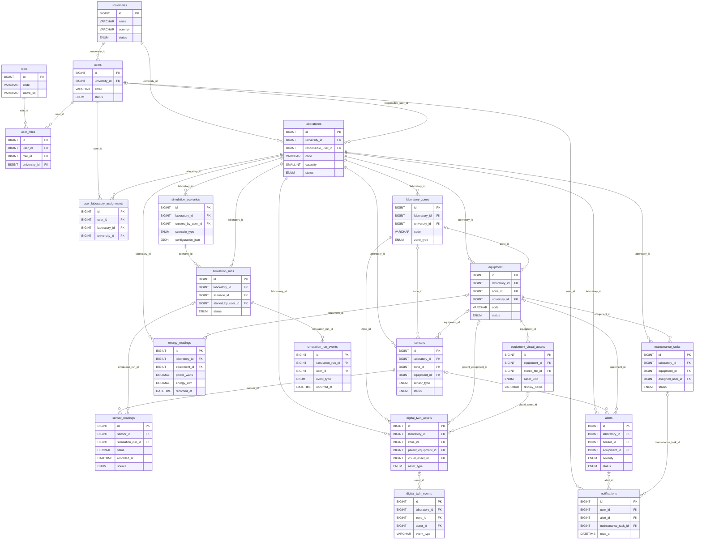

# CampusLab Twin – Database Structure

This ERD is derived from the MySQL `*.up.sql` migrations through migration 018, checked against the database access code. It is a **selected core schema**, not an exhaustive inventory of every auxiliary table. The source diagram is [campuslab-twin-erd.mmd](campuslab-twin-erd.mmd); the smaller Word-ready figure is [campuslab-twin-erd-thesis.svg](campuslab-twin-erd-thesis.svg).

## Core technical ERD

## Main tables

| Table | Purpose |
| --- | --- |
| `universities` | Tenant / institution record. |
| `users`, `roles`, `user_roles` | University accounts and their many-to-many role assignments. Platform administrators are stored separately in `platform_admins`. |
| `laboratories`, `user_laboratory_assignments` | Laboratory configuration and the many-to-many user access assignment. |
| `laboratory_zones` | Spatial zones, including saved coordinates/dimensions and the zone configuration added in migration 005. |
| `equipment`, `sensors` | Physical/registered devices; a sensor may optionally refer to an equipment item or zone. |
| `sensor_readings`, `energy_readings` | Timestamped telemetry. `energy_readings.equipment_id` is nullable, allowing a laboratory-level reading. |
| `alerts`, `notifications`, `maintenance_tasks` | Operational incidents, user notifications, and equipment maintenance. Notification links to alerts and maintenance tasks are optional. |
| `simulation_scenarios`, `simulation_runs`, `simulation_run_events` | Scenario definitions, their executions, and the run timeline. Sensor readings may optionally identify the simulation run that generated them. |
| `equipment_visual_assets`, `digital_twin_assets`, `digital_twin_events` | Model/image metadata, placed 3D objects, and recorded Digital Twin operations. `digital_twin_assets.parent_equipment_id` is optional. |

## Main relationships and notation

The database uses `universities.id` as the tenant boundary. Most tenant-owned child relationships are **composite foreign keys** such as `(laboratory_id, university_id) → laboratories(id, university_id)`; the ERD shows each as one logical relationship. A solid one-to-many relationship means the child FK is required. A relationship with `o|` on the parent side means its child FK is nullable; for example, a sensor need not be attached to a particular equipment item. Mermaid shows only selected relationships so the figure remains readable; it does not replace the migration SQL as the exhaustive FK list.

There is **no declared FK from `digital_twin_assets` to `sensors`**, no FK from `alerts` to `sensor_readings`, and no `simulation_run_id` in `energy_readings`. These were intentionally not drawn. Likewise, `laboratories.model_file_id`, `universities.logo_file_id`, and `stored_files.related_entity_id` are not declared foreign keys in the migrations and are not presented as such.

Auxiliary tables omitted from the diagram include authentication/session, password reset, audit, registration, settings, calibration, aggregate, maintenance-evidence, file-storage, reporting, chat, and migration-history tables. They are present in the schema but would obscure the core operational structure in an academic figure. The Digital Twin is represented by persisted `digital_twin_assets`; it is not a standalone copy of the sensor database.

## Evidence from the Codebase

| Table / Relationship | Evidence in codebase | Notes |
| --- | --- | --- |
| Database engine and migration source | [`migration-runner.js`](../server/src/database/migration-runner.js#L1), [`pool.js`](../server/src/database/pool.js#L1) | MySQL (`mysql2`); ordered `*.up.sql` migrations. `schema_migrations` is migration metadata. |
| `universities → users`, `universities → laboratories` | [`001_initial_schema.up.sql`](../server/migrations/001_initial_schema.up.sql#L4), [users FK](../server/migrations/001_initial_schema.up.sql#L102), [laboratories FK](../server/migrations/001_initial_schema.up.sql#L173) | Required tenant membership. |
| `users ↔ roles` via `user_roles` | [`001_initial_schema.up.sql`](../server/migrations/001_initial_schema.up.sql#L75), [junction/FKs](../server/migrations/001_initial_schema.up.sql#L107) | Many-to-many; platform admins use a separate table. |
| `users ↔ laboratories` via `user_laboratory_assignments` | [`001_initial_schema.up.sql`](../server/migrations/001_initial_schema.up.sql#L181) | Many-to-many authorization scope. |
| `laboratories → laboratory_zones` | [`001_initial_schema.up.sql`](../server/migrations/001_initial_schema.up.sql#L201), [`005_laboratory_zone_configuration.up.sql`](../server/migrations/005_laboratory_zone_configuration.up.sql#L1) | Zone FK and later zone type/limits. |
| `laboratories / zones → equipment` | [`001_initial_schema.up.sql`](../server/migrations/001_initial_schema.up.sql#L224) | Laboratory required; zone optional. |
| `laboratories / zones / equipment → sensors` | [`001_initial_schema.up.sql`](../server/migrations/001_initial_schema.up.sql#L266) | Laboratory required; zone and equipment optional. |
| `sensors → sensor_readings`; optional `simulation_runs → sensor_readings` | [`001_initial_schema.up.sql`](../server/migrations/001_initial_schema.up.sql#L312), [run FK](../server/migrations/001_initial_schema.up.sql#L520), [simulator writes](../server/src/modules/simulator/repository.js#L532) | Source can be simulated, physical, or imported. |
| `laboratories / equipment → energy_readings` | [`001_initial_schema.up.sql`](../server/migrations/001_initial_schema.up.sql#L336), [energy queries](../server/src/modules/energy/repository.js#L34) | Equipment FK nullable. |
| `laboratories / sensors / equipment → alerts` | [`001_initial_schema.up.sql`](../server/migrations/001_initial_schema.up.sql#L361), [simulator writes](../server/src/modules/simulator/repository.js#L567) | Sensor and equipment FKs nullable. |
| `users / alerts / maintenance_tasks → notifications` | [`001_initial_schema.up.sql`](../server/migrations/001_initial_schema.up.sql#L554), [`012_maintenance_notifications.up.sql`](../server/migrations/012_maintenance_notifications.up.sql#L1), [notification reads](../server/src/modules/notifications/repository.js#L16) | User FK required; alert/task FKs optional. |
| `equipment → maintenance_tasks` | [`001_initial_schema.up.sql`](../server/migrations/001_initial_schema.up.sql#L401) | Required equipment and laboratory FKs. |
| `laboratories → simulation_scenarios → simulation_runs → simulation_run_events` | [`001_initial_schema.up.sql`](../server/migrations/001_initial_schema.up.sql#L463), [runs](../server/migrations/001_initial_schema.up.sql#L490), [`014_simulation_experiments.up.sql`](../server/migrations/014_simulation_experiments.up.sql#L12), [runtime access](../server/src/modules/simulator/repository.js#L449) | Scenarios/runs required; run timeline added later. |
| `equipment → equipment_visual_assets` | [`017_equipment_visual_assets.up.sql`](../server/migrations/017_equipment_visual_assets.up.sql#L4) | A visual asset can refer to a stored file or a built-in key. |
| `laboratories / zones / equipment / visual assets → digital_twin_assets` | [`016_digital_twin_operations.up.sql`](../server/migrations/016_digital_twin_operations.up.sql#L1), [`017_equipment_visual_assets.up.sql`](../server/migrations/017_equipment_visual_assets.up.sql#L35), [Twin repository](../server/src/modules/digital-twin/repository.js#L17) | Zone/laboratory required; parent equipment/visual asset optional. No sensor FK. |
| `digital_twin_assets → digital_twin_events` | [`016_digital_twin_operations.up.sql`](../server/migrations/016_digital_twin_operations.up.sql#L32), [event writes](../server/src/modules/digital-twin/repository.js#L24) | Event asset FK nullable. |

**Verification boundary:** The checked-in migration-defined schema and backend queries are the source of the diagram. A read-only query of the local `schema_migrations` table confirmed that migrations 001 through 018 are recorded as applied. This is not an independent column-by-column export of `information_schema`. `npm run db:verify` was also attempted, but its demo-data check failed because the demonstration university lacked the complete demo dataset; that failure does not establish a schema difference.
