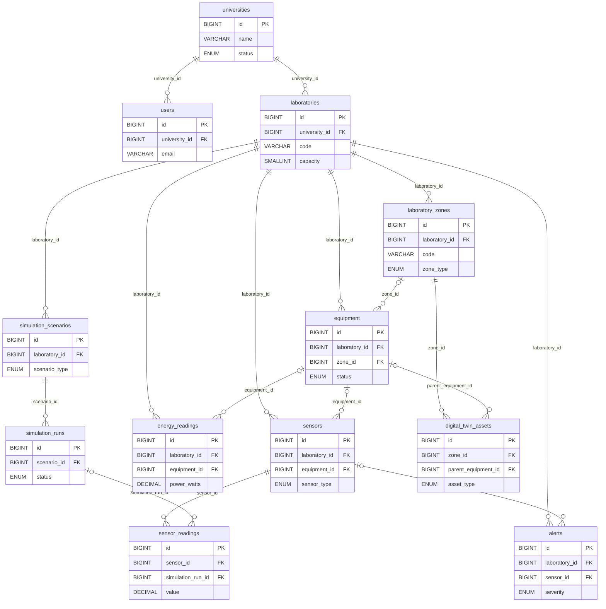

# CampusLab Twin – Database Structure

## Thesis-ready ERD

The [SVG figure](campuslab-twin-erd-thesis.svg) is the clean version for Word (preferably a landscape page). Its editable Mermaid source is [campuslab-twin-erd-thesis.mmd](campuslab-twin-erd-thesis.mmd).

**Suggested caption:** Figura X. Struktura e bazës së të dhënave të CampusLab Twin.

## Short explanation

`universities` is the tenant root. Each university has `users` and `laboratories`. A laboratory contains `laboratory_zones`, `equipment`, and `sensors`. A sensor produces `sensor_readings`; energy use is recorded separately in `energy_readings`, optionally for a particular equipment item. `alerts` belong to a laboratory and may point to a sensor or equipment item. `simulation_scenarios` define runs; a simulated sensor reading may refer back to the `simulation_runs` record. `digital_twin_assets` are placed 3D objects belonging to a laboratory zone and may optionally point to registered equipment.

The drawing intentionally omits roles, user-to-laboratory assignments, notifications, maintenance, reports, audit, authentication, stored files, telemetry aggregates, and Digital Twin event/chat tables. They are in the real schema; see the [technical ERD and evidence table](database-erd.md). In the actual database, most tenant-scoped FKs include both an entity ID and `university_id`; the small diagram abbreviates those composite keys. Dashed relationships in the SVG indicate nullable FKs. No direct `digital_twin_assets → sensors` FK is implied.

## Evidence from the Codebase

| Table / Relationship | Evidence in codebase | Notes |
| --- | --- | --- |
| University, user, laboratory | [`001_initial_schema.up.sql`](../server/migrations/001_initial_schema.up.sql#L4), [users](../server/migrations/001_initial_schema.up.sql#L85), [laboratories](../server/migrations/001_initial_schema.up.sql#L152) | Required tenant FKs. |
| Zones, equipment, sensors | [zones](../server/migrations/001_initial_schema.up.sql#L201), [equipment](../server/migrations/001_initial_schema.up.sql#L224), [sensors](../server/migrations/001_initial_schema.up.sql#L266), [zone additions](../server/migrations/005_laboratory_zone_configuration.up.sql#L1) | Zone and equipment links can be nullable where marked. |
| Readings and alerts | [sensor readings](../server/migrations/001_initial_schema.up.sql#L312), [energy readings](../server/migrations/001_initial_schema.up.sql#L336), [alerts](../server/migrations/001_initial_schema.up.sql#L361) | Persisted telemetry and operational incidents. |
| Scenario and run | [scenarios](../server/migrations/001_initial_schema.up.sql#L463), [runs](../server/migrations/001_initial_schema.up.sql#L490), [reading/run FK](../server/migrations/001_initial_schema.up.sql#L520) | Scenario and run are separate tables. |
| Placed Digital Twin asset | [`016_digital_twin_operations.up.sql`](../server/migrations/016_digital_twin_operations.up.sql#L1), [visual asset addition](../server/migrations/017_equipment_visual_assets.up.sql#L35) | Zone FK required; equipment FK nullable. |
