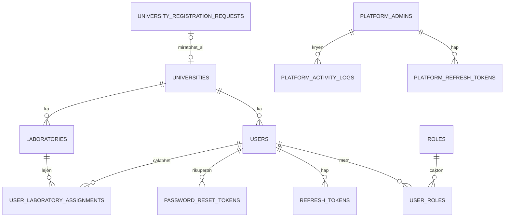
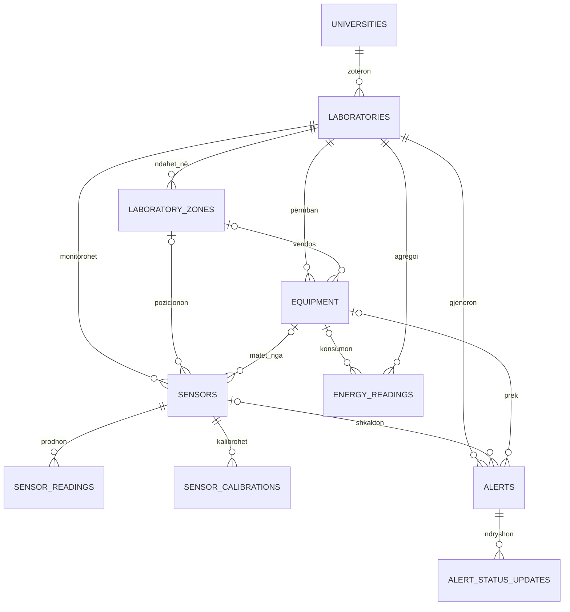
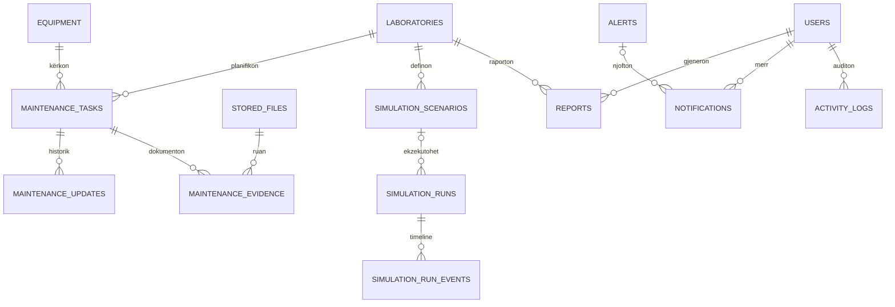

# Databaza dhe ERD

CampusLab Twin përdor MySQL dhe migrime SQL të versionuara, pa ORM. Migrimi
fillestar krijon modelin bazë; migrimet pasuese shtojnë historik, agregate,
preferenca dhe kontrolle të reja pa ndryshuar checksum-in e migrimeve të vjetra.

## Pronësia tenant

`universities` është rrënja e tenant-it. Çdo tabelë operacionale ka
`university_id NOT NULL` dhe indeks që fillon me këtë kolonë. Foreign keys të
përbëra, si `(laboratory_id, university_id)`, pengojnë lidhjen e një resursi me
një rekord të universitetit tjetër.

Katër tabela janë globale: `universities`, `university_registration_requests`,
`platform_admins` dhe `roles`. Tabelat e autentikimit të platformës janë të
ndara nga `users` dhe `refresh_tokens` tenant.

## Identiteti dhe qasja



## Laboratori dhe Digital Twin



Pozicioni dhe dimensionet e zonës ruhen si JSON. Sensorët kanë koordinata dhe
rotacion numerik. Pajisjet lidhen me zonën dhe mund të kenë
`object_3d_reference` për nyjën përkatëse në modelin GLB/GLTF.

## Mirëmbajtja, simulimi dhe raportimi



Historiku i statusit dhe timeline-i i simulimit janë append-only në nivelin e
shërbimit dhe mbrohen edhe me triggers të migrimeve. Evidenca e mirëmbajtjes
lidh metadata tenant me një rekord në `stored_files`; path-i fizik nuk pranohet
nga klienti.

## Leximet dhe retention-i

`sensor_readings` dhe `energy_readings` ruajnë të dhënat raw me burim
`physical`, `simulated` ose burime të tjera të lejuara. Worker-i periodik krijon
`sensor_reading_aggregates` dhe `energy_reading_aggregates` para se të pastrojë
raw history sipas konfigurimit. Agregatet ruajnë minimumin, maksimumin,
mesataren, numrin e mostrave, intervalin dhe burimin.

## Katalogu i tabelave

### Platforma dhe identiteti

- `universities`
- `university_registration_requests`
- `platform_admins`
- `platform_refresh_tokens`
- `platform_activity_logs`
- `platform_registration_settings`
- `institutional_email_exceptions`
- `users`
- `roles`
- `user_roles`
- `refresh_tokens`
- `password_reset_tokens`
- `user_laboratory_assignments`

### Operacionet tenant

- `laboratories`
- `laboratory_zones`
- `equipment`
- `sensors`
- `sensor_calibrations`
- `sensor_readings`
- `sensor_reading_aggregates`
- `energy_readings`
- `energy_reading_aggregates`
- `university_energy_settings`
- `alerts`
- `alert_status_updates`
- `maintenance_tasks`
- `maintenance_updates`
- `maintenance_evidence`
- `simulation_scenarios`
- `simulation_runs`
- `simulation_run_events`
- `reports`
- `notifications`
- `activity_logs`
- `stored_files`
- `university_preferences`
- `digital_twin_assets`
- `digital_twin_events`
- `digital_twin_messages`
- `equipment_visual_assets`

## Migrimet

`schema_migrations` krijohet nga migrator-i dhe ruan versionin, emrin dhe
checksum-in. Komandat operative janë:

```bash
npm run db:migrate
npm run db:rollback
npm run db:verify
```

`db:migrate` aplikon vetëm versionet që mungojnë. `db:rollback` kthen vetëm
migrimin e fundit. `db:verify` kontrollon tabelat, kolonat, foreign keys,
indekset tenant dhe hash-et e kredencialeve demo.
