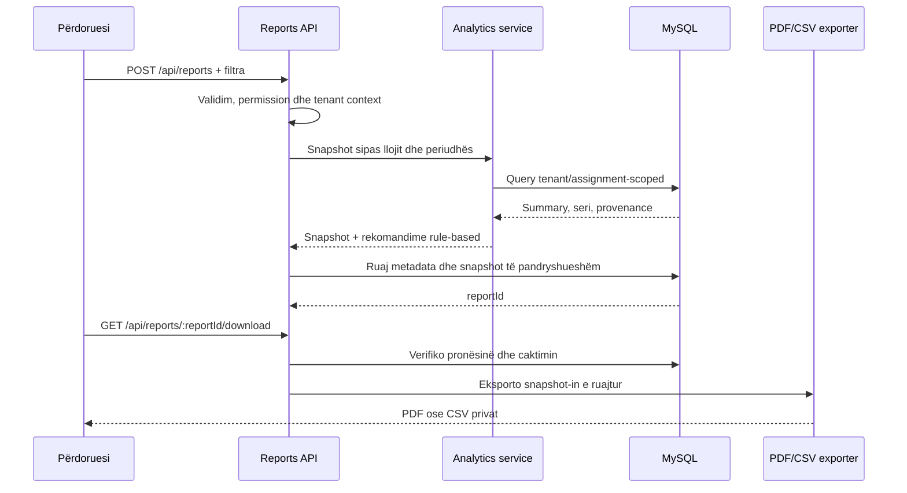

# Simulimi, shëndeti dhe raportimi

## Qëllimi i simulatorit

Simulatori prodhon të dhëna sintetike për demonstrim, testim dhe eksperimente
të riprodhueshme. Vlerat nuk janë matje nga pajisje reale. Çdo lexim i krijuar
ka `source: "simulated"`; dashboard-i, analitika dhe raportet e ruajnë këtë
provenance dhe e paraqesin në ndërfaqe.

Gjeneratori është determinist: i njëjti seed, konfigurim dhe rend tick-esh japin
të njëjtën sekuencë. State-i i gjeneratorit ruhet me run-in, prandaj pause,
resume dhe rikthimi pas restart-it vazhdojnë nga gjendja e persistuar.

## Modeli bazë

Vlerat fillestare default janë 22 °C, 45% lagështi, 450 ppm CO₂, zero persona,
zero tym, zero fuqi, 230 V dhe 100% shëndet pajisjeje. Çdo tick lëviz gradualisht
drejt një target-i dhe shton noise të vogël determinist. Ndryshimi normal për
tick kufizohet, për shembull, në 0.25 °C temperaturë, 0.6% lagështi, 40 ppm CO₂
dhe 500 W fuqi.

Target-et varen nga:

- numri bazë i personave dhe kapaciteti;
- ngarkesa dhe fuqia nominale e pajisjeve;
- efikasiteti i ventilimit;
- temperatura ambientale dhe CO₂ i jashtëm;
- degradimi i pajisjeve;
- incidenti aktiv i skenarit.

Ngarkesa dhe prania rrisin temperaturën, CO₂ dhe fuqinë. Ventilimi ul
temperaturën, lagështinë dhe ndikimin e personave në CO₂. Shëndeti i dobët rrit
konsumin me një penalitet gradual. Vlerat kufizohen gjithmonë brenda intervaleve
fizike të konfiguruara.

## Skenarët

<!-- scenarios:start -->

| Kodi                  | Përshkrimi                            | Efekti kryesor                                       |
| --------------------- | ------------------------------------- | ---------------------------------------------------- |
| `temperature_rise`    | Rritje e shpejtë e temperaturës       | Shton deri në 5 °C × intensiteti te target-i         |
| `ventilation_failure` | Dështim i ventilimit dhe rritje e CO₂ | Vendos efikasitetin e ventilimit në zero             |
| `equipment_failure`   | Dështim i pajisjes                    | Përshpejton rënien e shëndetit të pajisjes           |
| `sensor_offline`      | Sensor jashtë linje                   | Ndal leximet e sensorit të zgjedhur gjatë incidentit |
| `overcapacity`        | Kapacitet i tejkaluar                 | Rrit praninë mbi kapacitetin e laboratorit           |
| `smoke_incident`      | Incident tymi dhe sigurie             | Rrit target-in e tymit sipas intensitetit            |
| `power_spike`         | Rritje e menjëhershme e fuqisë        | Shton shumëzuesin e fuqisë                           |
| `energy_saving`       | Ndërhyrje për kursim të energjisë     | Ul fuqinë kundrejt të njëjtit baseline               |

<!-- scenarios:end -->

Override-et e lejuara janë `intensity` 0.1–3, `startTick`, `durationTicks`,
`previewTicks` deri në 60, `baselineOccupancy`, `equipmentLoad` 0–1 dhe
`targetSensorId`. Fushat e panjohura refuzohen. Preview është determinist dhe
nuk shkruan në databazë; start krijon run të auditueshëm dhe nis coordinator-in.

## Alarmi nga simulimi

Pas krijimit të një tick-u, rule engine krahason leximet vetëm me sensorët e
ngarkuar për atë tenant dhe laborator. Pragjet critical kanë përparësi ndaj
warning. Persistimi i leximeve, energjisë, state-it dhe kandidatëve të alarmit
kryhet para publikimit Socket.IO. Alarmet aktive deduplikohen, që i njëjti kusht
të mos krijojë njoftime të pakufizuara.

## Formula e shëndetit të infrastrukturës

Dashboard-i llogarit një score të plotë 0–100:

```text
base = averageEquipmentHealth, ose 100 kur nuk ka pajisje
faultPenalty = faultEquipment / totalEquipment × 20
offlinePenalty = offlineSensors / totalSensors × 20
criticalAlertPenalty = min(criticalAlerts × 5, 20)

infrastructureHealth = round(
  clamp(base - faultPenalty - offlinePenalty - criticalAlertPenalty, 0, 100)
)
```

Shembull: 90% shëndet mesatar, 1/10 pajisje me defekt, 2/20 sensorë offline dhe
1 alarm kritik japin `90 - 2 - 2 - 5 = 81`.

Formula është tregues operacional i prototipit, jo standard certifikimi ose
diagnozë e pajisjeve. Faktorët individualë dërgohen me summary-n që rezultati të
jetë i shpjegueshëm.

## Rrjedha e raportit



Llojet e raportit janë `laboratory`, `energy`, `alerts`, `equipment_health`,
`maintenance` dhe `simulation`. Krijimi kërkon titull, periudhë pozitive, format
PDF/CSV dhe burimin e kërkuar. Analitika zbulon provenance-in real; snapshot-i
ruan kohën e gjenerimit, filtrat, summary-n, serinë dhe rekomandimet.

CSV-ja ka BOM UTF-8 dhe neutralizon qelizat që fillojnë me `=`, `+`, `-` ose
`@`, për të parandaluar formula injection. PDF-ja përmban metadata, përmbledhje,
rekomandime dhe identifikuesin e raportit. Download-i kontrollon përsëri
tenant-in dhe caktimin në laborator dhe përdor `Cache-Control: private, no-store`.

## Kalimi te IoT real

Simulatori mund të zëvendësohet nga një adapter ingestion pa ndryshuar modelin e
faqeve. Adapter-i i ardhshëm do të autentikonte pajisjen, do të maponte ID-në e
sensorit te tenant-i/laboratori, do të validonte njësinë dhe timestamp-in, dhe
do të persistonte `sensor_readings` ose `energy_readings` me burim fizik.

Pas persistimit, i njëjti rule engine, alert lifecycle, analytics service,
Socket.IO publisher dhe report flow mund të ripërdoren. Kërkesat shtesë për
production përfshijnë device credentials, message broker, deduplikim mesazhesh,
clock-skew handling, retry/dead-letter queue dhe monitorim të ingestion-it.
